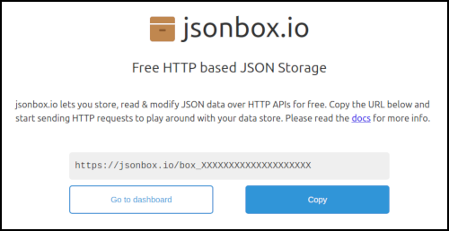
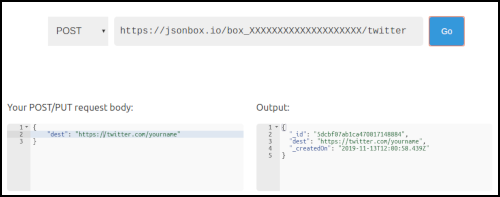

# URL Shortener

## Deploy your own

### Zeit account

Sign up for a [Zeit](https://zeit.co) account if you don't have one already, and install the `now` command-line utilities.

### jsonbox.io account

You don't really create an account, you just need to head to [jsonbox.io](https://jsonbox.io) and save the box identifier somewhere safe.



The X's will be a unique code for you to use to connect to the jsonbox API.

***Don't lose this!*** You'll need it for the next step, and also for the future when you need to manage your redirects.

### IPGeolocation account

Sign up for an [IP Geolocation](https://ipgeolocation.io/) account, and grab the API key - you'll need it in the next step.

### Clone and deploy!

Now run the following in your terminal:

```
git clone https://github.com/bendechrai/url-shortener.git
cd url-shortener
now secret add urlshortener_jsonbox <box_XXXXXXXXXXXXXXXXXXXX>
now secret add ipgeolocation_apikey <XXXXXXXXXXXXXXXXXXXXXXXXXXXXXXXX>
now --prod
```

## Managing redirects

## Import

Already have shortcuts in mind? Migrating from another system? Create an import.csv file in the `/tools/` directory, and run the import script (tested on Linux). Pass the jsonbox ID in via the command line thus:

```
BOXID=box_xxxxxxxxxxxxxxxxxxxx ./import.sh 
```

### Manual management

Head to `https://jsonbox.io/dashboard.html?box=box_XXXXXXXXXXXXXXXXXXXX`.

### Adding a new redirect

Say you want to redirect **https://url-shortener.yourname.now.sh/twitter** to **https://twitter.com/yourname**.

In the jsonbox.io dashboard, set the method to "POST", append **/twitter** to the URL, and set the request body to:

```
{
    "dest": "https://twitter.com/yourname"
}
```



### Using cURL

Of course, you can do this with cURL on the command-line right now:

```
curl https://jsonbox.io/box_XXXXXXXXXXXXXXXXXXXX/twitter \
     -H 'content-type: application/json' \
     --data-binary '{"dest": "https://twitter.com/yourname"}'
```

## Default redirect

If you go to the base URL of your URL Shortener (i.e.  https://url-shortener.yourname.now.sh/), this system will look for a shortcode of `__default__`. Creating a record at **https://jsonbox.io/box\_XXXXXXXXXXXXXXXXXXXX/\_\_default\_\_** will let you set the destination for this scenario.

## Redirect history

When you post a new destination for a given source to jsonbox.io, the data is appended to a list. When this script retrieves the list, it uses the latest destination. This means the history of destinations is maintained and, simply by POSTing a new destination to jsonbox.io, it's always possible to set a new destination.
